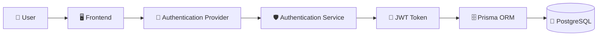
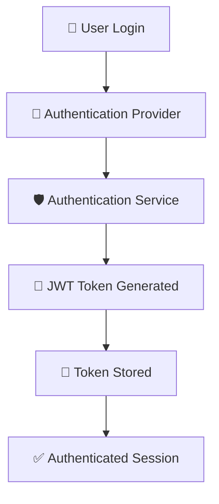
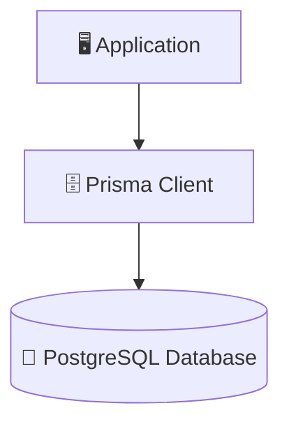

# 🎓 EDULIN – Authentication & Database Module

<div align="center">


### 🔐 Secure Authentication & Database Management System

#### For the EDULIN Educational Learning Platform

</div>


---

# 📖 Overview

The **Authentication & Database Module** is responsible for managing:

* 🔐 User Authentication
* 🛡️ Session Management
* 🔑 Password Security
* 🎫 JWT Authorization
* 🗄️ Database Connectivity
* 📊 User Data Storage

This system ensures secure user registration, login, session management, and database communication using modern authentication and database technologies.

---

# 🏗️ System Architecture



---

# 📂 Project Structure

```text
Authentication-System/
│
├── authentication-service.ts
├── authentication-provider.tsx
└── authentication-module-guide.md

Database/
│
├── database-client.ts
├── database-schema.prisma
├── database-migration.sql
└── database-setup-guide.md
```

---

# 🔐 Authentication System

## 📄 authentication-service.ts

### Handles

✅ Password Hashing using bcrypt

✅ Password Verification

✅ JWT Token Generation

✅ JWT Token Validation

✅ Authentication Security Utilities

---

## 📄 authentication-provider.tsx

### Handles

✅ User Login

✅ User Registration

✅ User Logout

✅ Authentication State Management

✅ Session Restoration

✅ Local Storage Integration

---

## 📄 authentication-module-guide.md

### Provides

✅ Authentication Documentation

✅ Security Workflow Explanation

✅ System Architecture Overview

✅ Environment Setup Instructions

---

# 🗄️ Database Module

## 📄 database-client.ts

### Handles

✅ Prisma Client Initialization

✅ Database Connection Management

✅ Development Connection Reuse

✅ Query Logging Configuration

---

## 📄 database-schema.prisma

### Defines

✅ Database Models

✅ Relationships

✅ Data Structures

✅ Prisma Schema Configuration

---

## 📄 database-migration.sql

### Contains

✅ Database Migration Scripts

✅ Schema Updates

✅ Database Version Management

---

# ⚙️ Technologies Used

| Category       | Technologies      |
| -------------- | ----------------- |
| Frontend       | React, TypeScript |
| Authentication | JWT, bcryptjs     |
| Database       | PostgreSQL        |
| ORM            | Prisma            |
| Framework      | Next.js           |
| Styling        | Tailwind CSS      |

---

# 🔄 Authentication Workflow



---

# 🗄️ Database Workflow



---

# 🛡️ Security Features

| Feature                         | Status |
| ------------------------------- | ------ |
| Password Hashing                | ✅      |
| JWT Authentication              | ✅      |
| Secure Session Management       | ✅      |
| Environment Variable Protection | ✅      |
| Authentication Verification     | ✅      |
| Invalid Session Cleanup         | ✅      |

---

# 🔑 Environment Variables

```env
DATABASE_URL=your_database_url
JWT_SECRET=your_secret_key
```

---

# 🚀 Future Improvements

* 🔹 Role-Based Authorization
* 🔹 Refresh Token Support
* 🔹 Multi-Factor Authentication
* 🔹 Activity Logging
* 🔹 Advanced Security Monitoring
* 🔹 Email Verification
* 🔹 Password Recovery System

---

# 👨‍💻 Developed By

## Hirpara Pruthvi

### Responsibilities

* 🔐 Authentication System
* 🗄️ Database Management
* 🛡️ Security Implementation
* 📚 Technical Documentation

---

# 📦 Version Information

| Property | Value                                |
| -------- | ------------------------------------ |
| Version  | 1.0                                  |
| Module   | Authentication & Database System     |
| Project  | EDULIN Educational Learning Platform |

---

<div align="center">

## ⭐ If you like this project, please give it a Star!

### 🚀 Made with ❤️ for Education and Learning

</div>
